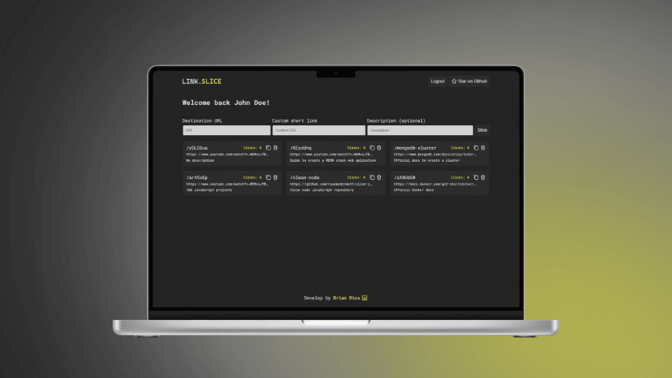

# Link.Slice

Simplify, Share, and Organize Your URLs

Link Slice is a service that simplifies link management and sharing by allowing users a fast and secure way to shorten, save, delete URLs quickly and conveniently.

Also, we have a Chrome extension that provides fast access to your shortened URLs.

This project uses the following technologies:

- **React**
- **Node Js**
- **Express**
- **Mongo DB**
- **Mongoose**
- **Sass**



## 💻 Getting Started

Install my-project with npm

- Step 1: Fork this project

- [Click here!](https://github.com/riosbrian/link-slice/fork)

- Step 2: Clone this repository

```bash
  git clone git@github.com:YOU_USER/link-slice.git
```

- Step 3: Install dependencies

```bash
  npm install
```

- Step 4: Build your app and add the manifest.json file to dist folder

```bash
  npm run build
```

- [manifest.json](https://github.com/riosbrian/link-slice/blob/main/manifest.json)

- Step 5: Upload dist folder in Chrome extensions

- [Chrome extensions](chrome://extensions/)
- [Chrome extensions official docs](https://developer.chrome.com/docs/extensions/get-started)

## Environment Variables

To run this project, you will need to add the following environment variables to your .env file

**/client**

`API_URL`

**/server**

`PORT`
`API_URL`
`CLIENT_URL`
`MONGO_URL`
`JWT_SECRET`

- GitHub auth

`GH_CLIENT_ID`
`GH_CLIENT_SECRET`
`GB_CALLBACK_URL`

- Google auth

`G_CLIENT_ID`
`G_CLIENT_SECRET`
`G_CALLBACK_URL`

Creating a MongoDB Atlas Cluster

- [Create a cluster](https://www.mongodb.com/docs/atlas/tutorial/create-new-cluster/)

GitHub Credentials

- [Create a new OAuth App.](https://docs.github.com/en/apps/oauth-apps/building-oauth-apps/creating-an-oauth-app)

Google Credentials

- [Create a new OAuth App.](https://developers.google.com/identity/protocols/oauth2?hl=es-419#1.-obtain-oauth-2.0-credentials-from-the-dynamic_data.setvar.console_name-.)

## API Documentation

Authentication Endpoints

| Método | Endpoint                  | Descripción                                      |
| ------ | ------------------------- | ------------------------------------------------ |
| GET    | /api/auth/github          | Redirects to GitHub for authentication           |
| GET    | /api/auth/github/callback | Callback endpoint for GitHub authentication      |
| GET    | /api/auth/google          | Redirects to Google for authentication           |
| GET    | /api/auth/google/callback | Callback endpoint for Google authentication      |
| GET    | /api/auth/user            | Returns authenticated user                       |
| POST   | /api/auth/logout          | Logs out user and removes JWT token from cookies |

Links Endpoints

| Método | Endpoint     | Descripción                                                               |
| ------ | ------------ | ------------------------------------------------------------------------- |
| GET    | /api/links   | Retrieves all links for the logged-in user.                               |
| DELETE | /api/:linkID | Deletes a URL. The URL id to be deleted is sent via req.params.           |
| GET    | /:link       | Redirects to the original URL. Receives the shortened URL via req.params. |

Slice Url

| Método | Endpoint   | Descripción                                                     |
| ------ | ---------- | --------------------------------------------------------------- |
| POST   | /api/slice | Shortens a link. Receives the following properties in req.body: |

```json
{
  "originalLink": "https://example.com",
  "description": "Optional description for the link",
  "customUrl": "Optional custom URL for the shortened link"
}
```

- originalLink: (required, string) - The original link to be shortened.
- description: (optional, string) - An optional description for the link.
- customUrl: (optional, string) - An optional custom URL for the shortened link.

## Authors

- [Brian Rios | Full Stack Developer](https://www.linkedin.com/in/brian-rios-5823a2214/)
